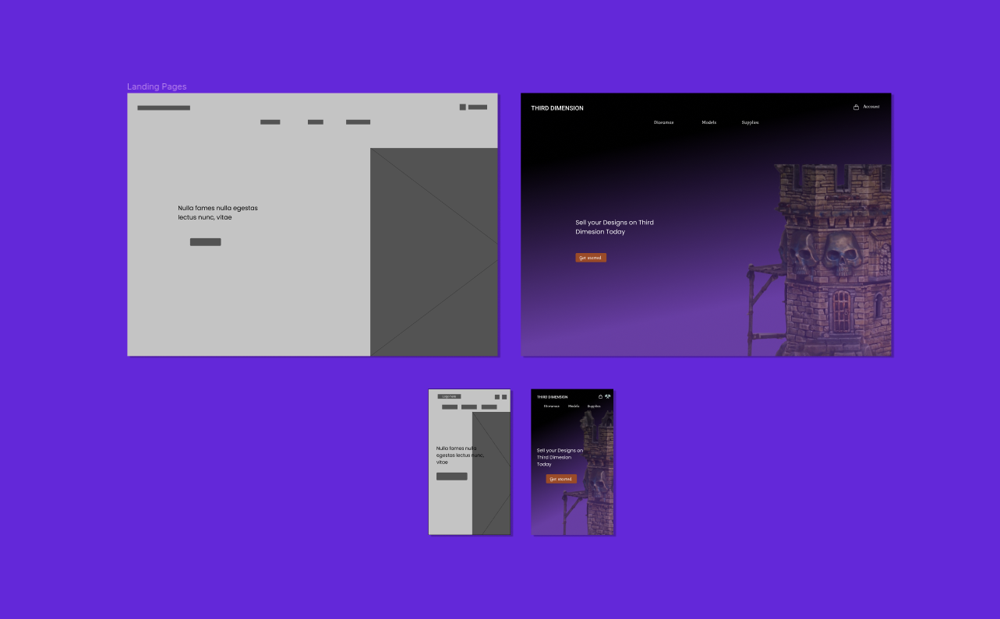
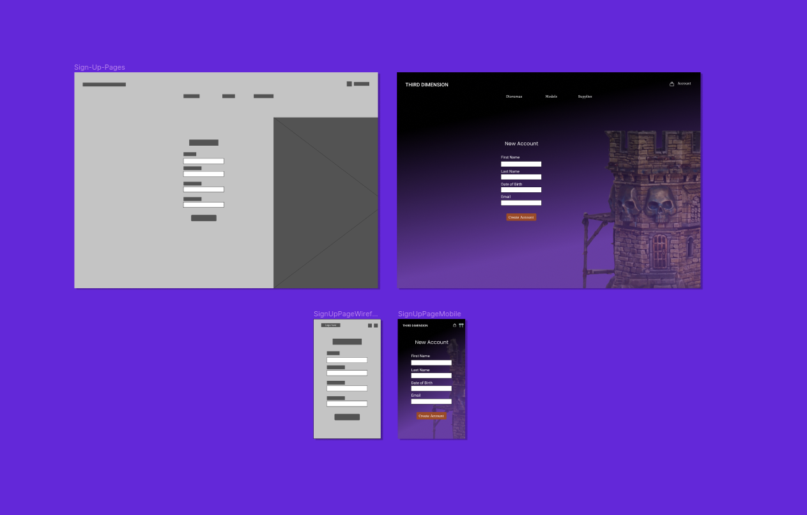
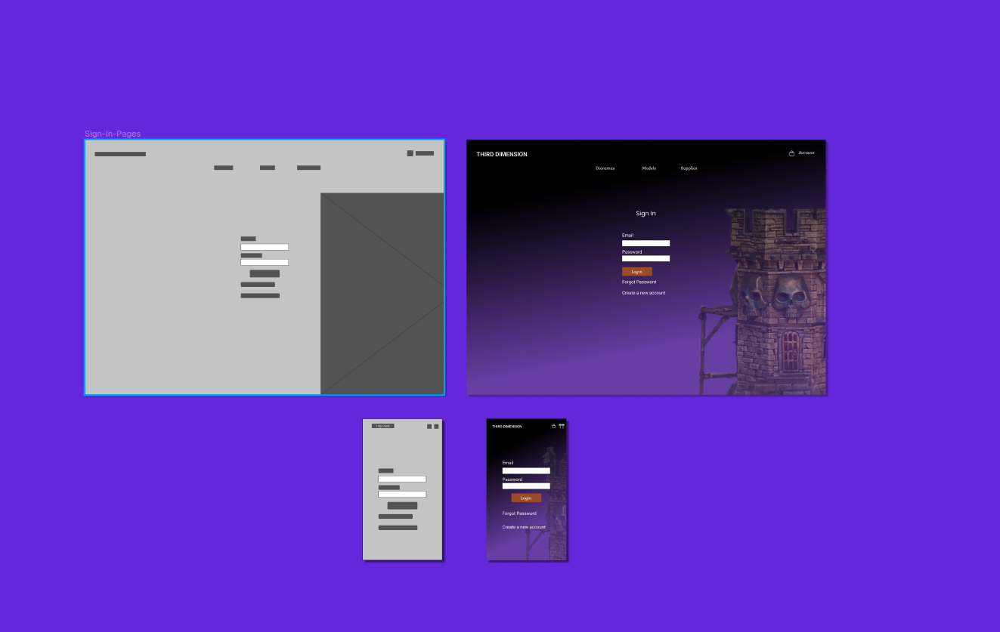
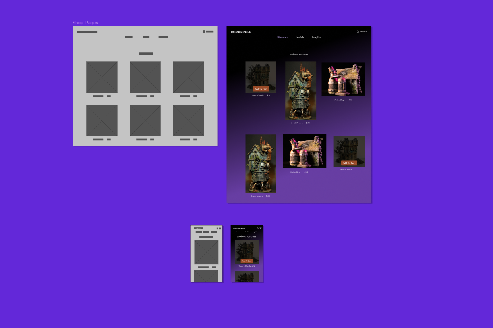
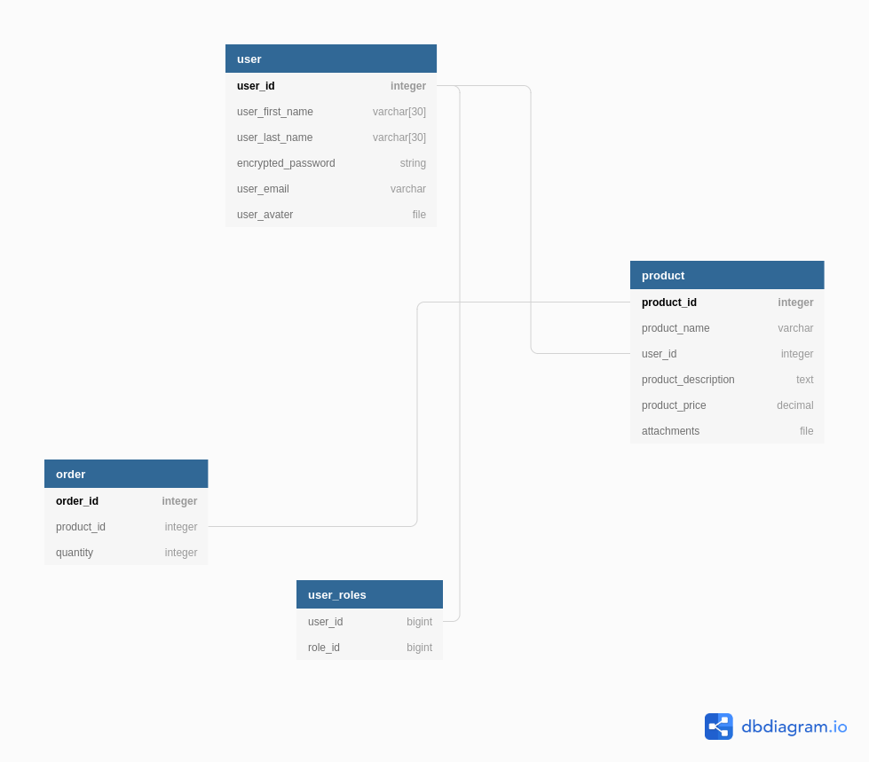

# ThirdDimension

### Two-Sided Marketplace

Designed and Developed by
Anthony Mann 2021

### Table of Contents

[Application overview](#application-overview)

[Why is it a problem that needs solving?](#the-problem)

[Description of your marketplace app](#Description-of-your-marketplace-app)

### Application overview

Third Dimension is a two-sided marketplace for the sale of Dioramas, 3D printer Models, and relevent supplies. The current marketplace is underdeveloped and not very accessible for all those who wish to create and sell their amazing creations or for those who wish to order one-of-a-kind Dioramas or purchase 3D model designs online.

### The Problem

This is a problem that I feel needs to be addressed as I have often found myself looking to purchase Dioramas that people have created, however, there is very limited availability, especially within Australia.

### Special links

[Website] - will be posted here on availability

[GitHub Repo](https://github.com/MrAjMann/ThirdDimension)

[Slide Deck](https://docs.google.com/presentation/d/1KejylKpCBGXut1z_emDu4aL7w75nO2b6TwPQTp5otOU/edit?usp=sharing)

# Description of your marketplace app

### Features and Functionality

- User Registration
- User Dashboard with Product management
- Each User can have an avatar - As a back-up it is connected to gravater
- **Stripe Connectivity**

### Target audience

The target audience for my online marketplace is those interested in Buying, Selling and Creation of 3D Models and Dioramas.

### Tech Stack:

Ruby on Rails - The heart of the application.
HTML - The layout of the application this includes **embedded ruby** code to help convey information to the user.
Bootstrap 4.6 - Used for a base styling
scss - Used to enhance / change Bootstraps initial styles
Heroku - Deployment of the Production Application
Cloudinary - Is used to store Images online in the cloud.
Github - Is used for version and source control.
Gravatar - Default profile Images

### Design MockUps

[Designs on Figma](https://www.figma.com/file/0BKfLJqugqiiPCjpgB4TXq/Third-Dimension?node-id=0%3A1)

---

#### Landing Pages



---

#### Sign Up Pages



---

#### Sign In Pages



---

#### Shop Pages



### Gems used

[Devise](https://github.com/heartcombo/devise)

[Simple Form](https://github.com/heartcombo/simple_form)

[Gravatar](https://github.com/mdeering/gravatar_image_tag)

### User Stories

- As a Buyer, I want to be able to view all available products without have to sign in or register an account.

- As a Seller I want to be able easily add my models to the store including multiple images.

- As a Registered user I want to be able to edit and remove my account.

- As a Registered user I want to be able to add a profile image or a logo to my account.

- As a Buyer I want a safe and easy to use way to pay for my purchases.

- As a Buyer user I don't want my creditcard details stored in a database.

- As a Seller I want to be able to remove products when I no longer have them in stock.

- As Registered user I want my password to be encrypted and secure.

- As a Registered user I don't want another seller to be able to edit or remove my products.

### ERD


[ERD on DB Diagrams.io](https://dbdiagram.io/d/603c5747fcdcb6230b21e7c8)

### High Level components (Abstractions)

In this application, I wanted a design that is easy to use and not overly complicated for both buyers and sellers.

The Design is very visual and will help guide a user to their destination, no matter if this is registering and selling products or simply browsing the collection and purchasing items for our merchants.

The marketplace application starts on a Landing page and depending on whether the user is registered or not will define what page the user will see. How? you ask, well let me explain:
Inside our application is what is known as a controller this in simple terms tells the application what to do based on a user's input, So I have a piece of code in this controller that will either show a landing page or a user profile page.

Our appropriately named controller.

```ruby
#Home Controller
#Setes the Page
  def page
  # We check if a user is signed in or not
		if current_user && user_signed_in?
    #if they are signed in then we show thier profile
			render :profile
		else
    #If not then we show the landing page
			render :page
		end
  end

```

As a registered user you have the option to be able to sell your creations to the the public on top of that you also gain access to your profile page, which gives you that access to manage your products and user information.

### Third Party Services

In my application, I used quite a few third-party services to achieve different functions and provide a better user experience. I

Cloudinary - This is a service that I am using to host product and profile images that can be displayed to the user.

Gravatar - This is a service that allows a user to have an automatically assigned profile image. (No registration by the user is needed on Gravatars end.), however, if you do have a gravatar account the profile image you have added to that will be used.

Stripe - Stripe is a third-party service that allows a user to safely and securely purchase their products, strip is completely PCI compliant and allows for multiple purchasing options.

Cancancan - I used cancancan for user authorization, this will help prevent a user's data from being accessed by unauthorized users.

Devise - I used devise for authentication within the application, this is arguably one of the most important features of my app.

Simple Form - This was implemented as it provides a ready made solution to creating forms within the application.

Bootstrap - I used bootstrap for generalised styling of the application, I felt this was necessary to complete this application within the given timeframe, however I will be removing bootstrap as soon as my assignment is marked.

### Database Relations
